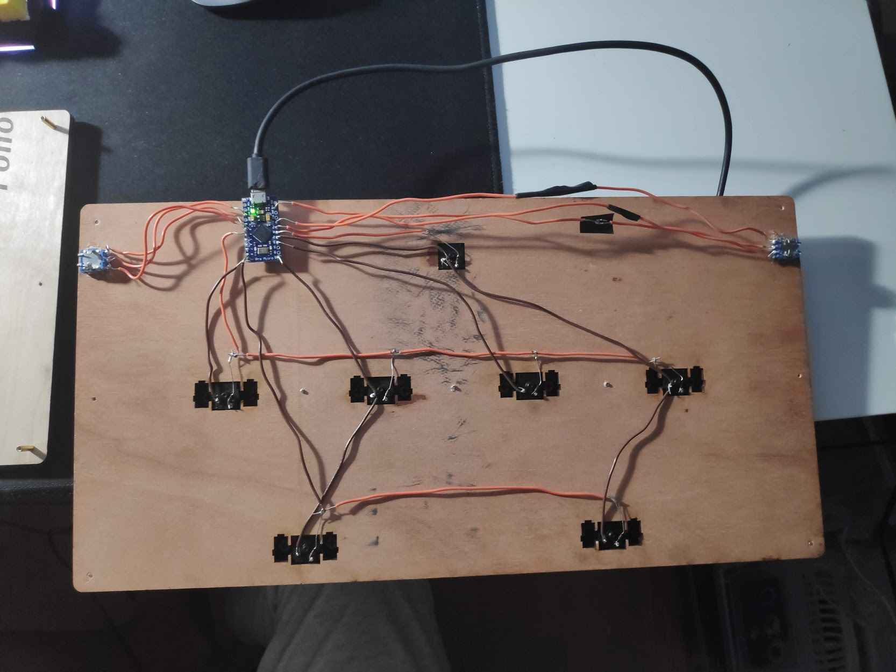
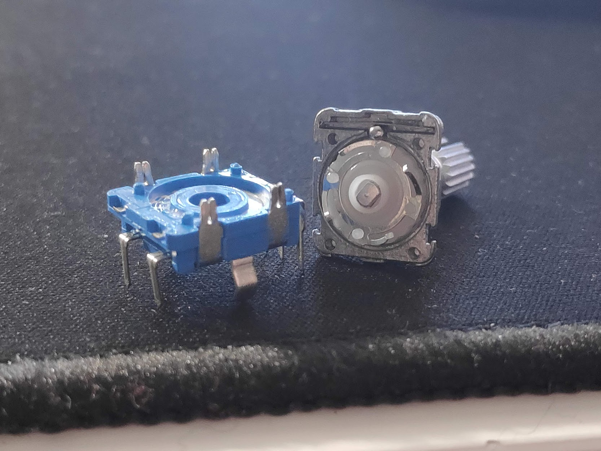

# lowcost-voltex

## Price Breakdown (in CAD):  
| Item | Cost |
| :--------------- | :---------------- |
| 2x EC11 Rotary Encoders (Detents Removed)  | 1.80  |
| 1x Knockoff Arduino Pro Micro  | 5.00 |
| 7x Gateron Brown Switches | ~2.00 |
| 2x Rotary Encoder Knobs (or 3D print if you have 3D Printer)  | 1.00 |
| 7x Cherry Keycaps (Any can work, suggest at least 2.0u)  | Free |
| 2x Plywood Scraps, Wires | Free |
| M2 Standoffs with M2 Screws | Basically Free | 
||
| **Total:** | CA$9.80 (US$6.90) |

## Setbacks
* Original laser cutting outline assumed using stablizers, but the wood was too thick so its still in there   
* EC11 has resolution of 20ppr, compared to the usual 600ppr from the original controllers  
* It uses normal keyboard keycaps, compared to Sanwas with a larger area to press.  
* Knobs are not as large, 3D printing the normal size can solve this (I had a 3D printed knob cover but I lost the file)  

## Materials
| Material Names |
| :--------------- |
2x Pieces of plywood  
7x M2 PCB standoffs
7x M2 Screws

## Hardware
||
| :--------------- |
2x EC11 Rotary Encoders (Detents removed, see below for details)  
2x Rotary Encoder knobs
7x Gateron Brown Mechanical Keyswitches  
7x 2.25u Keycaps (3D print them if needed)  
1x Arduino Pro Micro Clone  
7x 1N4148 Diodes  
Soldering Iron with Solder    
Laser Cutter (Or get it cut from somewhere)

## Software
QMK Toolbox  
QMK CLI

## Video Demo
[Youtube Link](https://youtu.be/W8n6pbJeWsM)

# Build Log
### Wiring:

If you'd like to build this, follow a tutorial on how to wire and flash a keyboard with QMK. The keymap is included in the repo.  
The two pieces were sandwiched by countersinking screws and using the M2 standoffs and screws to assemble them togther. The pieces of wood was laser cut using a Trotec 3000. 

### Removing Detents: 

To turn the detented rotation into a smooth optical-encoder like movement, take apart the encoder as shown in the image and remove the small metal ball that causes the detents. Reassemble and check to make sure the encoder still works
